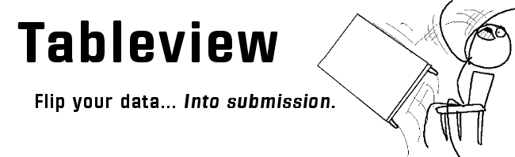

:orphan:

Tableview is a pythonic library for manipulating tabular data.  It is spiritually similar to Kenneth Reitz's `Tablib <http://python-tablib.org>`_, as well as the `view <http://docs.scipy.org/doc/numpy/reference/generated/numpy.ndarray.view.html>`_ functionality in numpy. 

Visit the :ref:`quickstart` guide if you'd like to get started.

.. include:: contents.rst.inc
